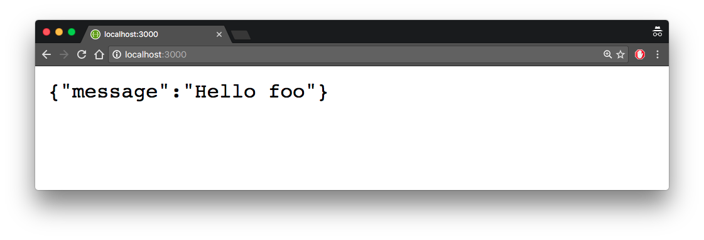
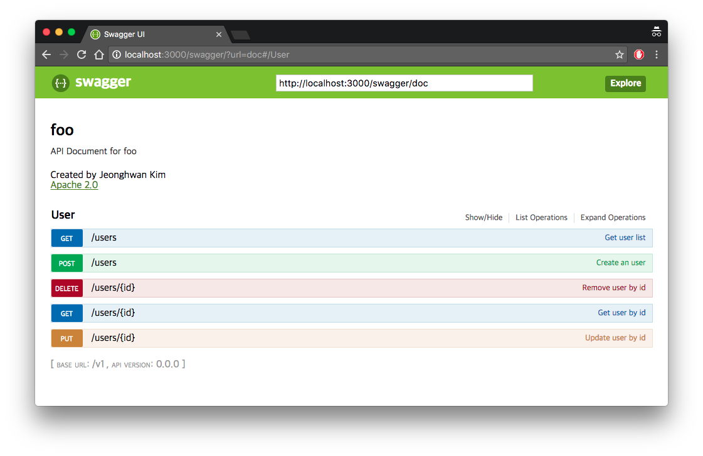
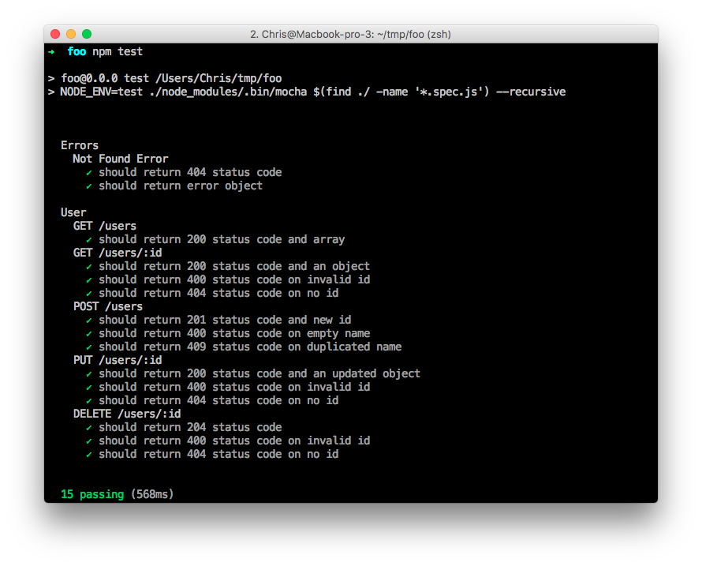

# generator-weplajs

> ExpressJS 프레임웍 기반의 REST API 서버 개발을 위한 요맨 제너레이터입니다.

> 버그리포팅과 이슈는 언제나 환영입니다.😍  언제든지 깃헙 [이슈](https://github.com/WePlanet/generator-weplajs/issues/new)에 등록해 주세요.

## 제너레이터

- App
  - weplajs
- API
  - weplajs:api
- Error code
  - Weplajs:error


## 설치

먼저 [npm](https://www.npmjs.com/)을 이용해 [Yeoman](http://yeoman.io)과 generator-weplajs를 여러분의 컴퓨터에 설치하세요. ([node.js]는 이미 설치되어 있다고 가정합니다.(https://nodejs.org/))

```bash
npm install -g yo
npm install -g generator-weplajs
```


그리고나서 여러분의 새로운 프로젝트를 만들어 보세요

```bash
yo weplajs
```

## 실행

새 프로젝트를 실행하기 전에 데이터베이스 생성해야 합니다. 요멘 제너레이터 프롬프트에서 입력한 데이터베이스 이름 뒤에 개발환경 정보를 나타내는 문자열이 포함된 이름의 데이터베이스를 생성해야 합니다.

예를들어 foo라는 데이터베이스 이름을 입력했다면 foo_development, foo_test, foo_production 데이터베이스를 추가 하세요

```
mysql> CREATE DATABASE mydb_development;
mysql> CREATE DATABASE mydb_test;
mysql> CREATE DATABASE mydb_production;
```

그리고나서 npm으로 새 프로젝트를 실행합니다.

```bash
npm start
[STARTUP_INFO] Sync Database {"force":true}
[STARTUP_INFO] Server listening on port 3000 development mode
```

이제 브라우져에서 [http://127.0.0.1:3000](http://127.0.0.1:3000 ) 주소에 접속할 수 있습니다.



[http://127.0.0.1:3000/swagger](http://127.0.0.1:3000/swagger)에 접속하여 개발 문서도 확인해 보세요.




## 테스트

Mocha, Supertest로 API의 유닛 테스트를 실행해 보세요.

```bash
npm test
```



